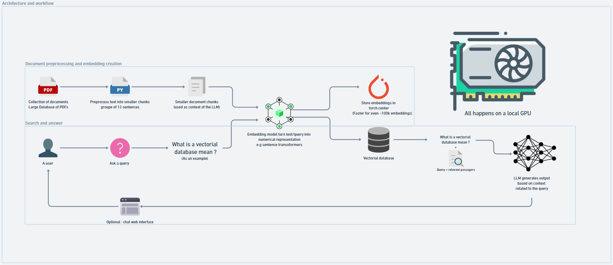

# NTTRAG-CHATBOT - RAG Pipeline Documentation
 

## Overview

This documentation outlines the setup and implementation of a Retrieval-Augmented Generation (RAG) pipeline. The RAG pipeline is designed to process and retrieve information from a large collection of documents, utilizing embeddings for efficient search and retrieval, and leveraging a language model to generate contextually relevant responses.

## Workflow Description

The workflow involves the following steps:

1. **Collection of Documents:** Gather a large database of documents (e.g., PDFs).
2. **Preprocessing:** Convert documents into smaller, manageable text chunks.
3. **Embedding Creation:** Transform text chunks into numerical embeddings.
4. **Embedding Storage:** Store embeddings for efficient retrieval.
5. **Query Processing:** Transform user queries into embeddings and retrieve relevant document passages.
6. **Response Generation:** Generate responses using a language model based on retrieved passages.
7. **User Interaction:** Provide an interface for users to interact with the system.


## Setup

**Clone the Repository:**

```bash
git clone https://github.com/3pac/NTTRAG-CHATBOT.git
cd NTTRAG-CHATBOT
```

## Concept

